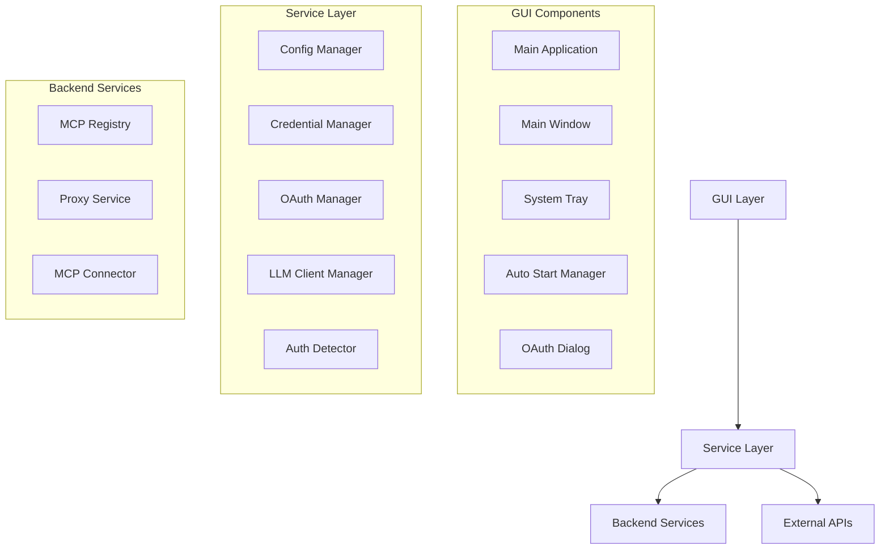

# Integration Points and API Contracts

## Overview

This document outlines the integration points and API contracts for Hive MCP Gateway, covering how different components interact and their expected interfaces.

## Core Architecture

### Service Layer Integration



## GUI Integration Points

### 1. Main Application (`gui/main_app.py`)

**Integration Points:**
- **Config Manager**: Loads/saves application configuration
- **Service Manager**: Controls backend MCP service lifecycle
- **Dependency Checker**: Monitors system dependencies
- **Auto Start Manager**: Manages macOS launch agents
- **System Tray**: Provides menu bar interface

**Key Methods:**
```python
def setup_backend_services(self) -> None:
    """Initialize all backend service managers."""

def show_autostart_settings(self) -> None:
    """Show auto-start configuration dialog."""

def show_oauth_authentication(self, server_name: str) -> None:
    """Initiate OAuth flow for MCP server."""
```

### 2. System Tray Integration (`gui/system_tray.py`)

**Signal Contracts:**
```python
# Service Control Signals
start_service_requested = pyqtSignal()
stop_service_requested = pyqtSignal()
restart_service_requested = pyqtSignal()

# Configuration Signals  
show_config_requested = pyqtSignal()
show_credentials_requested = pyqtSignal()
show_llm_config_requested = pyqtSignal()

# OAuth Signals
show_oauth_dialog_requested = pyqtSignal(str, dict)  # server_name, config
```

### 3. Auto Start Manager (`gui/autostart_manager.py`)

**Platform Integration:**
```python
class AutoStartManager:
    def enable_auto_start(self) -> bool:
        """Enable auto-start functionality."""
    
    def disable_auto_start(self) -> bool:
        """Disable auto-start functionality."""
    
    def is_auto_start_enabled(self) -> bool:
        """Check if auto-start is enabled."""
```

**macOS Implementation:**
```python
class MacOSAutoStartImpl:
    def create_launch_agent(self) -> bool:
        """Create macOS Launch Agent plist file."""
    
    def get_app_bundle_path(self) -> Optional[Path]:
        """Detect application bundle location."""
```

## Service Layer Contracts

### 1. Configuration Manager (`src/hive_mcp_gateway/services/config_manager.py`)

**Core Interface:**
```python
class ConfigManager:
    def load_config(self) -> ToolGatingConfig:
        """Load configuration with environment variable substitution."""
    
    def save_config(self, config: ToolGatingConfig, format: str = "json") -> None:
        """Save configuration in specified format."""
    
    def set_port(self, port: int) -> bool:
        """Update service port configuration."""
    
    def add_backend_server(self, name: str, config: BackendServerConfig) -> None:
        """Add new MCP server configuration."""
```

### 2. Credential Manager (`src/hive_mcp_gateway/services/credential_manager.py`)

**Storage Interface:**
```python
class CredentialManager:
    def set_credential(self, key: str, value: str, 
                      credential_type: Optional[CredentialType] = None) -> CredentialEntry:
        """Store credential with automatic sensitivity detection."""
    
    def get_credential(self, key: str) -> Optional[CredentialEntry]:
        """Retrieve credential by key."""
    
    def validate_keyring_access(self) -> Tuple[bool, str]:
        """Test system keyring access."""
```

**Integration with LLM Providers:**
- Stores API keys securely in system keyring
- Provides OAuth token storage for piggybacking
- Auto-detects credential sensitivity

### 3. OAuth Manager (`src/hive_mcp_gateway/services/oauth_manager.py`)

**Flow Management:**
```python
class OAuthManager:
    def initiate_oauth_flow(self, service_name: str) -> OAuthFlow:
        """Start OAuth authentication flow."""
    
    def handle_callback(self, authorization_response_url: str) -> Optional[OAuthFlow]:
        """Process OAuth callback with authorization code."""
    
    def get_valid_token(self, service_name: str) -> Optional[str]:
        """Get valid access token, refreshing if necessary."""
```

**Service Configurations:**
- Google OAuth (Gemini CLI integration)
- GitHub OAuth
- Microsoft OAuth  
- Claude Code OAuth (Anthropic)
- Custom OAuth configurations

### 4. LLM Client Manager (`src/hive_mcp_gateway/services/llm_client_manager.py`)

**Dual Authentication Strategy:**
```python
class LLMClientManager:
    def get_llm_credentials(self, provider: str) -> Optional[Dict[str, Any]]:
        """Get credentials with dual approach: piggybacking + direct API keys."""
    
    def _get_piggyback_credentials(self, provider: str) -> Optional[Dict[str, Any]]:
        """Attempt to use existing desktop client credentials."""
    
    def _get_direct_api_credentials(self, provider: str) -> Optional[Dict[str, Any]]:
        """Use directly configured API keys."""
```

**Provider Support:**
- OpenAI (direct API key)
- Anthropic (Claude Code piggybacking + direct)
- Google (Gemini CLI piggybacking + direct)
- Azure OpenAI
- Custom providers

## API Endpoints

### 1. OAuth Endpoints (`src/hive_mcp_gateway/api/oauth_endpoints.py`)

**Initiate OAuth Flow:**
```http
POST /api/oauth/initiate
Content-Type: application/json

{
    "server_name": "string",
    "service_name": "string (optional)",
    "custom_config": {
        "client_id": "string",
        "client_secret": "string",
        "authorization_url": "string",
        "token_url": "string",
        "scope": ["string"]
    },
    "custom_scope": ["string (optional)"]
}
```

**Complete OAuth Flow:**
```http
POST /api/oauth/complete
Content-Type: application/json

{
    "flow_id": "string",
    "callback_url": "string"
}
```

**OAuth Status:**
```http
GET /api/oauth/status?server_name={optional}
```

### 2. MCP Server Management

**Server Configuration:**
```http
GET /api/servers
POST /api/servers
PUT /api/servers/{server_id}
DELETE /api/servers/{server_id}
```

**Server Control:**
```http
POST /api/servers/{server_id}/start
POST /api/servers/{server_id}/stop  
POST /api/servers/{server_id}/restart
GET /api/servers/{server_id}/status
```

## Data Flow Integration

### 1. OAuth Authentication Flow

```
1. MCP Server → Auth Error → Auth Detector
2. Auth Detector → OAuth Required Event → GUI
3. GUI → OAuth Dialog → OAuth Manager
4. OAuth Manager → External OAuth Provider
5. OAuth Provider → Callback → OAuth Manager
6. OAuth Manager → Store Tokens → Credential Manager
7. Credential Manager → System Keyring (macOS)
```

### 2. Auto Start Configuration Flow

```
1. User → GUI Button → Main Window
2. Main Window → Auto Start Manager
3. Auto Start Manager → macOS Launch Agent
4. Launch Agent → ~/Library/LaunchAgents/com.hive.mcp-gateway.plist
5. System Restart → launchd → Auto Start Application
```

### 3. LLM Credential Resolution Flow

```
1. LLM Request → LLM Client Manager
2. LLM Client Manager → Check Preferred Auth Method
3a. Piggybacking: → Claude Code SDK / Gemini CLI SDK
3b. Direct: → Credential Manager → System Keyring
4. Resolved Credentials → HTTP Request → LLM Provider
```

## Error Handling Contracts

### 1. Authentication Errors

**OAuth Errors:**
```python
class OAuthResult:
    success: bool
    token_data: Optional[Dict[str, Any]]
    expires_at: Optional[datetime]
    error: Optional[str]
```

**Credential Errors:**
```python
class CredentialEntry:
    key: str
    value: str
    credential_type: CredentialType
    description: Optional[str]
    auto_detected: bool
```

### 2. Configuration Errors

**Validation Results:**
```python
class ValidationResult:
    is_valid: bool
    errors: List[str]
    warnings: List[str]
```

## Platform-Specific Integration

### macOS Integrations

**Launch Agents:**
- Location: `~/Library/LaunchAgents/com.hive.mcp-gateway.plist`
- Management: `launchctl load/unload`
- Auto-detection: `mdfind` for app bundle location

**Keyring Integration:**
- Service: `hive-mcp-gateway`
- Storage: macOS Keychain
- API: Python `keyring` library

**Application Bundle Detection:**
```python
# Search paths for HiveMCPGateway.app
/Applications/HiveMCPGateway.app
~/Applications/HiveMCPGateway.app
~/Desktop/HiveMCPGateway.app
~/Downloads/HiveMCPGateway.app
```

**OAuth Client Credential Paths:**
```python
# Claude Code
~/Library/Application Support/Claude Code/oauth_tokens.json

# Gemini CLI  
~/.gemini/oauth_creds.json
```

## Signal/Slot Contracts

### GUI to Service Communication

```python
# Service Lifecycle
start_service_requested() → ServiceManager.start_service()
stop_service_requested() → ServiceManager.stop_service()
restart_service_requested() → ServiceManager.restart_service()

# Configuration
show_config_requested() → ConfigurationDialog.show()
show_credentials_requested() → CredentialManager.show()

# OAuth Authentication
oauth_authentication_requested(server_name, config) → OAuthDialog.initiate_oauth()

# Auto Start
show_autostart_settings_requested() → AutoStartManager.show_dialog()
```

### Service to GUI Communication

```python
# Status Updates
status_changed(status: str) → GUI.update_status_display()
dependency_status_changed(service_name: str, is_running: bool) → GUI.update_dependencies()

# OAuth Events
oauth_flow_completed(server_name: str, success: bool) → GUI.show_notification()
oauth_flow_failed(server_name: str, error: str) → GUI.show_error()

# Configuration Changes
config_changed(config: ToolGatingConfig) → GUI.reload_configuration()
server_added(server_name: str) → GUI.refresh_server_list()
```

## Security Considerations

### Credential Storage
- **Sensitive data**: Stored in system keyring (macOS Keychain)
- **Non-sensitive data**: Stored in JSON configuration files
- **Auto-detection**: Automatic sensitivity classification
- **Encryption**: System-level encryption via keyring

### OAuth Security
- **PKCE**: Enabled by default for enhanced security
- **State parameter**: Prevents CSRF attacks
- **Token storage**: Encrypted in system keyring
- **Token refresh**: Automatic with secure storage

### File Permissions
- **Configuration files**: User read/write only
- **Launch Agent**: Standard launchd permissions
- **Credential files**: Protected by system keyring

## Testing Integration Points

### Unit Tests
- Individual component functionality
- Service manager interfaces
- Configuration persistence
- Credential storage/retrieval

### Integration Tests  
- OAuth flow end-to-end
- Auto start functionality
- GUI to service communication
- Cross-platform compatibility

### Manual Testing
- macOS-specific behavior verification
- User experience validation
- Error handling verification
- Performance testing

## Development Integration

### Adding New MCP Servers
1. Use JSON snippet processor
2. Automatic credential extraction
3. OAuth requirement detection
4. Service registration

### Adding New LLM Providers
1. Configure in LLM Client Manager
2. Choose authentication method (piggybacking/direct)
3. Test connection
4. Save configuration

### Adding New OAuth Providers
1. Create OAuthConfig
2. Configure client credentials
3. Test authorization flow
4. Store tokens securely

This documentation serves as the definitive guide for understanding how all components integrate within the Hive MCP Gateway ecosystem.