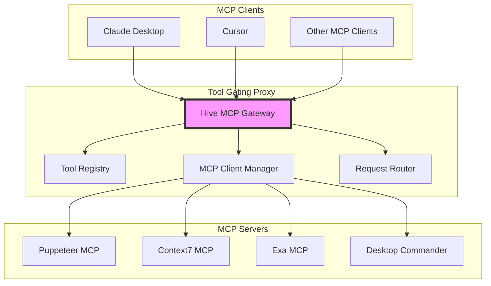

# Hive MCP Gateway Proxy Architecture Plan

## Overview

Hive MCP Gateway will be transformed into a **proxy/router** that sits between MCP clients (Claude Desktop, Cursor, etc.) and multiple MCP servers. This allows dynamic tool discovery and provisioning while maintaining a single connection point for clients.

## Problem Statement

1. **Current Limitation**: MCP clients load all servers at startup and cannot dynamically add servers during a conversation
2. **Context Bloat**: Loading 100+ tools from multiple servers exhausts the context window
3. **MCP Connector**: Only available in Messages API, not in desktop clients like Claude Desktop or Cursor

## Research Findings

### Existing Solutions Evaluated

1. **mcp-proxy-server** (TypeScript)
   - Simple aggregator that exposes ALL tools from ALL servers
   - No intelligence - just routing
   - Wrong language (TypeScript vs our Python)
   - Missing: semantic search, token budgets, tool ranking

2. **LangChain MultiServerMCPClient** (Python)
   - Client library, not an MCP server
   - Can select tools by server, but not by relevance
   - Good patterns for connection management
   - Missing: semantic discovery, token management, ranking

### Key Insight
Neither solution provides intelligent tool selection - they either expose everything (mcp-proxy-server) or require manual server selection (LangChain). Tool Gating's unique value is the **intelligence layer** that selects relevant tools within context constraints.

### What We Can Reuse
- **From LangChain**: Connection patterns, session management, error handling
- **From mcp-proxy-server**: Configuration structure, Claude Desktop integration approach

## Solution: Tool Gating as a Proxy



## Architecture Components

### 1. MCP Client Manager
- Maintains persistent connections to all registered MCP servers
- Uses the MCP Python SDK's `StdioClientTransport` for stdio servers
- Handles connection lifecycle (connect, reconnect, disconnect)
- Discovers and caches available tools from each server

### 2. Tool Registry
- Central repository of all available tools across servers
- Maps tool IDs to their source MCP server
- Stores tool metadata (description, parameters, estimated tokens)
- Supports semantic search for tool discovery

### 3. Request Router
- Routes tool execution requests to the appropriate MCP server
- Handles request/response transformation
- Manages provisioned vs available tools

### 4. Core MCP Tools Exposed

```python
# Tools exposed by Tool Gating to MCP clients
@tool
async def discover_tools(query: str, tags: list[str] = None, limit: int = 10):
    """Discover available tools based on semantic search"""
    
@tool
async def provision_tools(tool_ids: list[str], context_tokens: int = 1000):
    """Provision specific tools for use (makes them available)"""
    
@tool
async def list_provisioned_tools():
    """List currently provisioned tools"""
    
@tool
async def execute_tool(tool_name: str, arguments: dict):
    """Execute a provisioned tool (routes to appropriate MCP server)"""
    
@tool
async def list_mcp_servers():
    """List all connected MCP servers"""
```

## Implementation Plan

### Phase 1: Basic Proxy (MVP)

#### Files to Implement/Update:

1. **`src/tool_gating_mcp/services/mcp_client_manager.py`** (NEW)
   ```python
   from mcp import ClientSession, StdioClientTransport
   from typing import Dict, Any, Optional
   
   class MCPClientManager:
       """Manages connections to multiple MCP servers"""
       def __init__(self):
           self.sessions: Dict[str, ClientSession] = {}
           self.transports: Dict[str, StdioClientTransport] = {}
           self.server_tools: Dict[str, list] = {}  # Cache tools per server
       
       async def connect_server(self, name: str, config: dict):
           """Connect to an MCP server via stdio"""
           transport = StdioClientTransport(
               command=config["command"],
               args=config.get("args", []),
               env=config.get("env", {})
           )
           
           async with ClientSession(transport) as session:
               await session.initialize()
               
               # Discover and cache tools
               tools_result = await session.list_tools()
               self.server_tools[name] = tools_result.tools
               
               self.sessions[name] = session
               self.transports[name] = transport
   ```

2. **`src/tool_gating_mcp/services/proxy_service.py`** (NEW)
   ```python
   from typing import Dict, Any, List
   from .mcp_client_manager import MCPClientManager
   from .repository import InMemoryToolRepository
   from ..models.tool import Tool
   
   class ProxyService:
       """Handles proxy operations for Tool Gating"""
       def __init__(self, client_manager: MCPClientManager, tool_repository: InMemoryToolRepository):
           self.client_manager = client_manager
           self.tool_repository = tool_repository
           self.provisioned_tools: set[str] = set()
       
       async def discover_all_tools(self):
           """Discover tools from all connected servers"""
           for server_name, tools in self.client_manager.server_tools.items():
               for tool in tools:
                   # Convert MCP tool to our Tool model
                   tool_obj = Tool(
                       id=f"{server_name}_{tool.name}",
                       name=tool.name,
                       description=tool.description,
                       parameters=tool.inputSchema,
                       server=server_name,
                       tags=[]  # Extract from description if needed
                   )
                   await self.tool_repository.add_tool(tool_obj)
       
       async def execute_tool(self, tool_id: str, arguments: dict) -> Any:
           """Execute a provisioned tool via proxy"""
           if tool_id not in self.provisioned_tools:
               raise ValueError(f"Tool {tool_id} not provisioned")
           
           # Extract server and original tool name
           server_name, tool_name = tool_id.split('_', 1)
           session = self.client_manager.sessions.get(server_name)
           
           if not session:
               raise ValueError(f"Server {server_name} not connected")
           
           # Execute tool on remote server
           result = await session.call_tool(tool_name, arguments)
           return result
   ```

3. **`src/tool_gating_mcp/api/proxy.py`** (NEW)
   ```python
   from fastapi import APIRouter, Depends, HTTPException
   from typing import Any, Dict
   from pydantic import BaseModel
   
   from ..services.proxy_service import ProxyService
   
   router = APIRouter(prefix="/api/proxy", tags=["proxy"])
   
   class ExecuteToolRequest(BaseModel):
       tool_id: str
       arguments: Dict[str, Any]
   
   @router.post("/execute")
   async def execute_tool(
       request: ExecuteToolRequest,
       proxy_service: ProxyService = Depends(get_proxy_service)
   ) -> Any:
       """Execute a tool through the proxy"""
       try:
           result = await proxy_service.execute_tool(
               request.tool_id, 
               request.arguments
           )
           return {"result": result}
       except Exception as e:
           raise HTTPException(status_code=400, detail=str(e))
   ```

### Phase 2: Optimization
1. **Connection Pooling**: Reuse connections for better performance
2. **Caching**: Cache tool lists and common responses
3. **Parallel Execution**: Execute tools on multiple servers concurrently
4. **Error Handling**: Graceful degradation when servers are unavailable

### Phase 3: Advanced Features
1. **Authentication**: Support for API keys (store in env vars)
2. **Tool Composition**: Chain multiple tools together
3. **Usage Analytics**: Track which tools are used most
4. **Dynamic Server Registration**: Add/remove servers at runtime

## Key Files to Update

### 1. **`src/tool_gating_mcp/main.py`** (UPDATE)
Add proxy initialization and MCP tool for execution:
```python
from .services.mcp_client_manager import MCPClientManager
from .services.proxy_service import ProxyService
from .api import proxy

# Initialize proxy components on startup
@app.on_event("startup")
async def startup_event():
    # Initialize client manager
    client_manager = MCPClientManager()
    
    # Connect to configured servers
    for server_name, config in MCP_SERVERS.items():
        await client_manager.connect_server(server_name, config)
    
    # Initialize proxy service
    proxy_service = ProxyService(client_manager, tool_repository)
    await proxy_service.discover_all_tools()
    
    # Store in app state for dependency injection
    app.state.proxy_service = proxy_service

# Add proxy router
app.include_router(proxy.router)

# Add MCP tool for tool execution
@mcp_tool
async def execute_tool(tool_id: str, arguments: dict) -> Any:
    """Execute a provisioned tool on the appropriate MCP server"""
    return await app.state.proxy_service.execute_tool(tool_id, arguments)
```

### 2. **`src/tool_gating_mcp/config.py`** (UPDATE)
Add MCP server configurations:
```python
MCP_SERVERS = {
    "context7": {
        "command": "npx",
        "args": ["-y", "@upstash/context7-mcp@latest"],
        "description": "Documentation search",
    },
    "puppeteer": {
        "command": "mcp-server-puppeteer",
        "args": [],
        "description": "Browser automation",
    },
    "desktop-commander": {
        "command": "npx",
        "args": ["@wonderwhy-er/desktop-commander@latest"],
        "description": "Desktop automation",
    }
}
```

### 3. **`pyproject.toml`** (UPDATE)
Add MCP SDK dependency:
```toml
[project]
dependencies = [
    # ... existing dependencies ...
    "mcp>=0.1.0",  # MCP Python SDK for client connections
]
```

## Configuration

### Simple Servers to Support First
Only servers that require no auth or single API key:

```python
# config.py
MCP_SERVERS = {
    "context7": {
        "command": "npx",
        "args": ["-y", "@upstash/context7-mcp@latest"],
        "description": "Documentation search",
        "auth": "none"
    },
    "puppeteer": {
        "command": "mcp-server-puppeteer",
        "args": [],
        "description": "Browser automation",
        "auth": "none"
    },
    "desktop-commander": {
        "command": "npx",
        "args": ["@wonderwhy-er/desktop-commander@latest"],
        "description": "Desktop automation",
        "auth": "none"
    }
}
```

## Testing Strategy

### 1. Unit Tests
- Test MCP client connections
- Test tool discovery
- Test request routing
- Test provisioning logic

### 2. Integration Tests
```python
async def test_end_to_end_workflow():
    # 1. Start Tool Gating proxy
    proxy = ToolGatingProxy()
    await proxy.start()
    
    # 2. Connect Claude Code with only Tool Gating
    # 3. Discover tools for "web search"
    # 4. Provision "puppeteer_screenshot"
    # 5. Execute screenshot tool
    # 6. Verify result
```

### 3. Performance Tests
- Measure latency of proxied vs direct calls
- Test with many concurrent tool executions
- Verify memory usage with many connected servers

## Benefits of This Architecture

1. **Single Connection Point**: Clients only need to connect to Tool Gating
2. **Dynamic Tool Management**: Tools can be discovered and provisioned on-demand
3. **Context Efficiency**: Only provisioned tools consume context
4. **Universal Compatibility**: Works with ALL MCP clients
5. **Scalability**: Can manage hundreds of servers and thousands of tools
6. **Flexibility**: Easy to add new servers without client changes

## Implementation Summary

### What We're Building
A simple proxy that:
1. Connects to multiple MCP servers via stdio (using MCP Python SDK)
2. Discovers all available tools on startup
3. Exposes a single `execute_tool` MCP tool that routes to appropriate servers
4. Manages tool provisioning to stay within context limits

### Key Implementation Files

| File | Purpose | Status |
|------|---------|--------|
| `services/mcp_client_manager.py` | Manages MCP server connections | NEW |
| `services/proxy_service.py` | Handles tool routing and execution | NEW |
| `api/proxy.py` | REST API for proxy operations | NEW |
| `main.py` | Add startup initialization and execute_tool | UPDATE |
| `config.py` | Add MCP_SERVERS configuration | UPDATE |
| `pyproject.toml` | Add mcp dependency | UPDATE |

### Why This Approach

1. **Simplicity**: Leverages existing Tool Gating intelligence
2. **Best Practices**: Uses patterns from LangChain for connections
3. **Maintainable**: Clear separation of concerns
4. **Extensible**: Easy to add auth, caching, etc. later

## Next Steps

1. **Phase 1 Implementation** (Immediate)
   - Create MCPClientManager with basic stdio connections
   - Implement ProxyService for tool routing
   - Add execute_tool MCP tool
   - Test with 2-3 simple servers (no auth)

2. **Testing** (After Phase 1)
   - Verify tool discovery from multiple servers
   - Test execute_tool routing
   - Measure performance overhead
   - Confirm Claude Desktop integration

3. **Phase 2** (Based on Phase 1 results)
   - Add authentication support (API keys)
   - Implement connection pooling
   - Add caching for frequently used tools

## Success Criteria

- ✅ Claude Desktop sees only Tool Gating's tools initially
- ✅ Can discover tools from multiple backend MCP servers
- ✅ Can provision and execute tools from any connected server
- ✅ Context usage reduced by 90%+ vs loading all servers
- ✅ Tool execution latency < 100ms overhead
- ✅ Zero configuration changes in Claude Desktop after setup
