# Hive MCP Gateway: Intelligent Tool Management

## Revolutionary MCP Tool Management System

Hive MCP Gateway transforms how AI assistants interact with MCP (Model Context Protocol) tools by introducing **LLM-powered intelligent tool gating** - preventing context bloat while maximizing capability access.

## The Problem: Traditional MCP Context Overload

### Traditional MCP Client Setup

```mermaid
graph TB
    subgraph "AI Client"
        A[Claude Desktop<br/>or other MCP Client]
    end
    
    subgraph "Direct Connections = Context Chaos"
        A --> B[Server 1: 8 tools]
        A --> C[Server 2: 12 tools] 
        A --> D[Server 3: 6 tools]
        A --> E[Server 4: 15 tools]
        A --> F[Server 5: 9 tools]
        A --> G[Server 6: 7 tools]
        A --> H[Server 7: 11 tools]
        A --> I[Server 8: 5 tools]
        A --> J[Server 9: 13 tools]
        A --> K[Server 10: 8 tools]
        A --> L[Server 11: 4 tools]
        A --> M[Server 12: 2 tools]
    end
    
    subgraph "The Problem"
        N[❌ ALL 100 tools loaded<br/>❌ 60,000 tokens consumed<br/>❌ Context window exhausted<br/>❌ Poor performance]
    end
    
    B --> N
    C --> N
    D --> N
    E --> N
    F --> N
    G --> N
    H --> N
    I --> N
    J --> N
    K --> N
    L --> N
    M --> N
    
    style A fill:#4a90e2,stroke:#333,stroke-width:2px,color:#fff
    style N fill:#ff6b6b,stroke:#333,stroke-width:2px,color:#fff
```


### The Reality
- **12 MCP Servers** each providing 5-15 tools
- **100+ Total Tools** loaded into context at startup
- **~60,000 tokens** consumed just for tool definitions
- **Context window exhausted** before actual work begins
- **Performance degradation** and higher costs

## The Solution: LLM-Managed Intelligent Tool Gating

### Hive MCP Gateway Architecture


## How LLM-Managed Tool Gating Works

### Request Flow Example


## Key Architecture Components

### 1. LLM-Powered Intelligence Layer
The **Internal LLM Manager** is the brain that drives tool gating decisions:

- **Semantic Understanding**: Uses sentence transformers (`all-MiniLM-L6-v2`) to understand tool relevance
- **Context Analysis**: Analyzes user requests to determine optimal tool selection
- **Dynamic Routing**: Manages tool discovery and execution across multiple servers
- **Intelligent Organization**: Orchestrates the entire tool management process

### 2. Intelligence-Driven Tool Gating Service
The **Tool Gating Service** executes LLM decisions with practical constraints:

- **Token Budget Management**: Default 2,000 token limit (configurable)
- **Tool Count Limits**: Maximum 10 tools per request (configurable)
- **LLM-Directed Selection**: Uses AI relevance scoring for optimal selection
- **Cross-Server Aggregation**: Seamlessly combines tools from all connected servers

### 3. Unified Connection Management
- **Single Connection Point**: Clients connect only to Hive MCP Gateway
- **Background Server Management**: Maintains persistent connections to all backend servers
- **Transparent Execution**: Routes tool calls to appropriate servers automatically

## Performance Comparison

### Traditional Setup vs Hive MCP Gateway

| Metric | Traditional MCP | Hive MCP Gateway | Improvement |
|--------|----------------|------------------|-------------|
| **Servers Connected** | 12 direct connections | 1 gateway connection | 92% reduction |
| **Tools Loaded** | 100 tools (all at once) | 3-5 tools (LLM-selected) | 95% reduction |
| **Context Tokens** | ~60,000 tokens | ~1,200 tokens | **98% reduction** |
| **Setup Complexity** | Configure 12+ servers | Configure 1 gateway | Simplified |
| **Performance** | Slow/context exhausted | Fast/optimal context | Dramatically improved |
| **Cost Efficiency** | High token costs | Minimal tool overhead | Significant savings |
| **Intelligence** | None (static loading) | AI-powered selection | Revolutionary |

### Real-World Example

**User Request**: *"I need to search for research papers and save them"*

#### Traditional MCP Response:
```
Context Consumed: 60,000 tokens (tool definitions)
Available Context: 140,000 tokens remaining
Tools Exposed: 100 tools (overwhelming choice)
Performance: Slow due to context bloat
Selection Process: Manual/guesswork
```

#### Hive MCP Gateway Response:
```
Context Consumed: 1,200 tokens (3 LLM-selected tools)
Available Context: 198,800 tokens remaining  
Tools Exposed: exa_research_search, file_write, pdf_extract
Performance: Optimal with 98% more context for actual work
Selection Process: AI-powered semantic understanding
```

## Core Technology Features

### 🧠 **LLM-Driven Intelligence**
- **Multi-Provider Support**: OpenAI, Anthropic, Google, Azure, Cohere, Replicate, HuggingFace, Mistral
- **Dual Authentication**: Piggybacking on desktop clients + direct API key configuration
- **Rate Limiting & Error Handling**: Enterprise-grade reliability
- **Semantic Tool Understanding**: AI comprehension of tool capabilities and relevance

### 🔧 **Advanced Tool Gating**
- **LLM-Managed Selection**: AI determines which tools are relevant for each task
- **Token Budget Enforcement**: Configurable limits prevent context overflow
- **Cross-Server Intelligence**: Combines tools from multiple sources intelligently
- **Dynamic Provisioning**: Tools loaded only when AI determines they're needed

### 🔐 **Enterprise Security**
- **OAuth Integration**: Secure authentication for protected MCP servers
- **Credential Management**: OS keyring integration for secure storage
- **Auto-Detection**: Automatic discovery of existing credentials

### 🖥️ **User Experience**
- **Native macOS Integration**: Menu bar app with auto-start capabilities
- **One-Click Setup**: Client configuration generation for popular IDEs
- **Real-Time Monitoring**: Live server status and health monitoring

## Benefits Summary

### For Individual Users
- **98% Context Savings**: More room for actual work, not tool definitions
- **Simplified Setup**: One gateway instead of dozens of server configurations
- **AI-Powered Tool Discovery**: LLM finds the right tools automatically
- **Cost Efficiency**: Dramatically reduced token usage

### For Teams & Enterprise
- **Scalable Architecture**: Handle hundreds of servers and thousands of tools
- **Centralized Management**: Single point of control for all MCP resources
- **Security Controls**: OAuth and credential management at scale
- **Performance Optimization**: Consistent fast response times through AI optimization

## The Revolutionary Difference

**Traditional MCP**: Static tool loading → Context bloat → Performance issues  
**Hive MCP Gateway**: LLM-managed dynamic selection → Optimal context → Peak performance

Hive MCP Gateway doesn't just aggregate MCP servers - it applies **artificial intelligence** to tool management, creating the first truly intelligent MCP gateway where an internal LLM actively manages and optimizes the tool ecosystem in real-time.

## Technical Implementation

The system operates on a **LLM-managed architecture** where:

1. **Internal LLM Manager**: Provides semantic intelligence for understanding tool relevance, context analysis, and dynamic routing decisions
2. **Tool Gating Service**: Executes the LLM's intelligent decisions within practical constraints (token budgets, tool limits)

This creates an **AI-driven tool management system** where the LLM actively analyzes requests, scores tool relevance across all connected servers, and dynamically selects the optimal tool set for each specific task - transforming static tool loading into intelligent, context-aware tool provisioning.