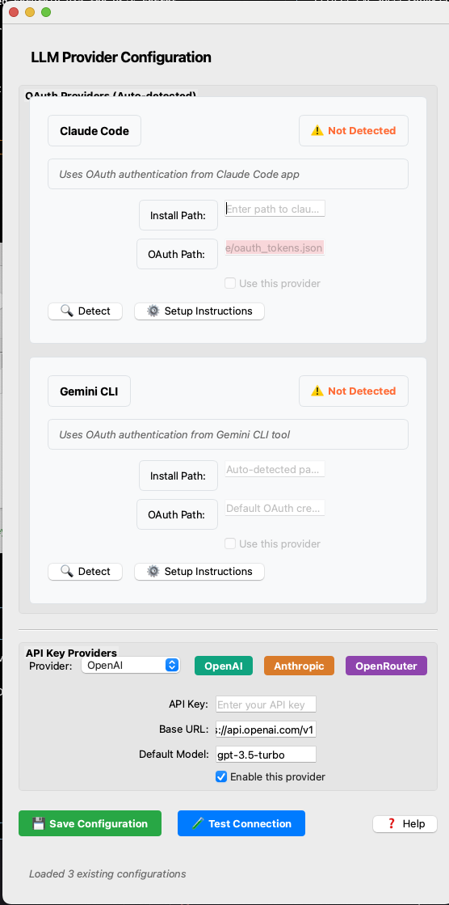

UI and UX Fixes and Changes:

## Themeing and Color Pallete
- to better match the Hive branding, let's alter the color pallete. Here is a CSS reference to base the theming off of. 
-- QSS Style Sheet - /Users/bbrenner/Documents/Scripting Projects/tool-gating-mcp/.superdesign/design_iterations/styles.qss
-- Design Tokens Reference - /Users/bbrenner/Documents/Scripting Projects/tool-gating-mcp/.superdesign/design_iterations/design_tokens.md

## Credential Management Window: 
= add simple descriptive verbiage to let the user know secrets are stored securely via the OS's secret store.
- Explain that the ENV's here are passed through to the MCP configuration for easy maintenance/changes. That said, if there a mapping feature in place so that the system knows what ENV's/Secrets belong to what MCP entry, or is it just matching the ENV itself? 
- Was the Auto-Detect ENV's/Secrets feature implemented? If someone uses the Add MCP Server wizard, and it contains ENV's/Secrets, will it auto-detect and add them to the credentials section?
--------------

## LLM Configuration Window:
= UI needs an overhaul. , Reference these design files and screenshots for reference of how to redesign it. 
-- HTML Reference Design file: /Users/bbrenner/Documents/Scripting Projects/tool-gating-mcp/.superdesign/design_iterations/llm_config_themed_1.html
-- Widget Mapping Guide: /Users/bbrenner/Documents/Scripting Projects/tool-gating-mcp/.superdesign/design_iterations/widget_mapping.md
-- 
-- 

## Main Window: 
- Dependencies: Claude Desktop is showing up in here... Claude Desktop is not a dependency, but a client. 
- Auto Start Button: Pops up a window saying "Auto Start Manager is not Available." This functonality needs to be fully implemented.
- Where does the user set a custom port? It seems like it's just fixed at 8001 now. 
- Status labels are duplicated, and in 2 columns. Left column has blank labels, right column has the labels again with the status. 
- Redesign of this window as well to modernize it. 
-- same design tokens and qss docs mentioned above
-- Widget Mapping for Main Window - /Users/bbrenner/Documents/Scripting Projects/tool-gating-mcp/.superdesign/design_iterations/control_center_widget_mapping.md
-- HTML Reference Design file: /Users/bbrenner/Documents/Scripting Projects/tool-gating-mcp/.superdesign/design_iterations/control_center_themed_1.html
-- Functionality improvement and additons as shown in the mockup. Status indicators, client detections, edit, remove and restart servers, etc. Any feature we listed in the mockup, needs to be functionally replicated. 

## Client Configurtation Window
- Part of the original specs that were not yet implemented. Utilitariaion window that detects the clients installed on the machine and provides the JSON snippets or BASH commands needed to add Hive MCP Gateway to the users client software
- Lauout and functionality of this is fully mocked and integrated into main window redesign files mentioned above. 
- The /path/to/mcp-proxy and server address details will be dynamically populated for the end user, it won't be placeholder values like in the mock demo. 
- The JSON configurations and BASH commands for popular clients will change depending on thier requirements, as depicted in the mock functions. If the user has something else that doesn't fit out presets, they can use the Generic tab which will be a standard stdio implementation. 